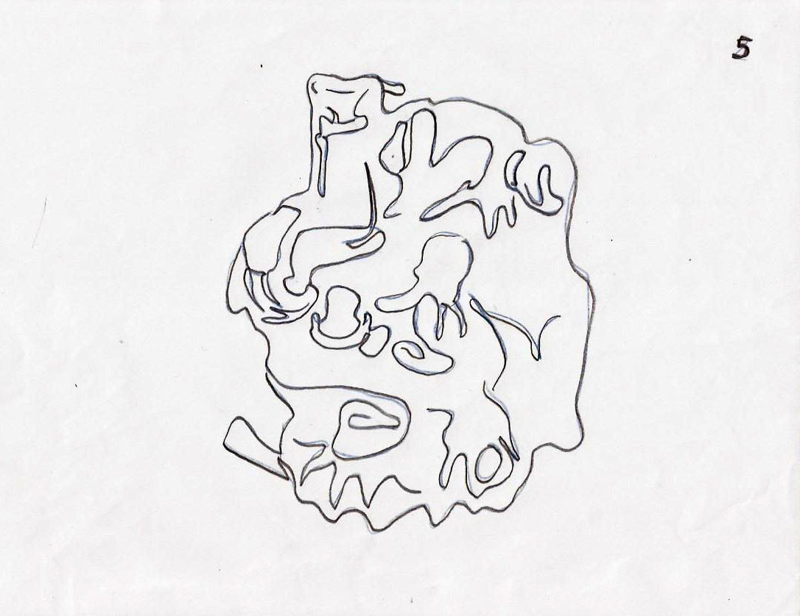
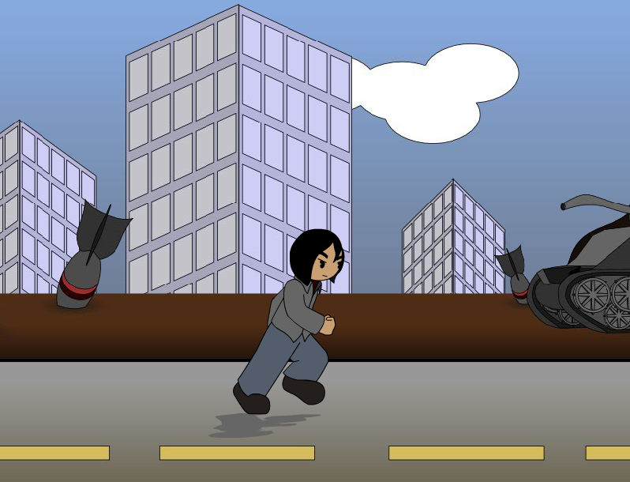

# Trabajos de introducción a la animación
*******

Este proyecto contiene cinco prácticas de animación, las primeras cuatro realizadas en Adobe Flash CS6 y la última (la practica cinco) en Adobe Flash CS3. En donde, cada una de estas prácticas suscribe un ejercicio acorde al título de la carpeta que lo contiene, de la siguiente forma:

 
<ul>
    <li>
Carpeta <strong>"1_Ejercicio_Transformaciones"</strong>: contiene un practica de transformación basada en cuatro dibujos diferentes, los cuales, cambian de uno a otro a través de la modificación de sus líneas.
    
</li>
</ul>

 

 
<ul>
    <li>
Carpeta <strong>"2_Ejercicio_Bolita saltando"</strong>: contiene una práctica de animación con un círculo saltando.
    
</li>
</ul>

 

 
<ul>
    <li>
Carpeta <strong>"3_Ejercicio_Costal saltando"</strong>: Contiene una práctica de animación con un costal saltando sobre una serie cajas y, al mismo tiempo, evadiendo a una sierra colgando del techo.
    
</li>
</ul>

 

 
<ul>
    <li>
Carpeta <strong>"4_Ejercicio_Salto de personaje"</strong>: Contiene una práctica de animación sobre dos personas a punto de pelear.
    
</li>
</ul>

 

 
<ul>
    <li>
Carpeta <strong>"5_Ejercicio_Caminando"</strong>: Contiene una práctica de animación con una persona caminando.
    
</li>
</ul>

 

*******
## Créditos

Autor: *Jorge Luis Jácome Domínguez*

######  Otros medios < [Linkedin](https://www.linkedin.com/in/jorge-luis-j%C3%A1come-dom%C3%ADnguez-44294a91/) - [Dibujando](https://dibujando.net/soragefroren) - [Facebook](https://www.facebook.com/SoraGefroren) - [Youtube](https://www.youtube.com/c/SoraGefroren) >
